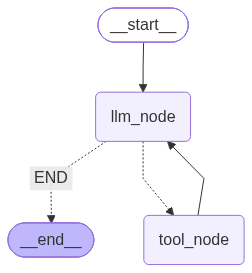

# 🚗 OLA AI Data Agent

An AI-powered, multi-agent data platform for OLA ride-hailing analytics — built with **LangGraph**, **LangChain**, and **PostgreSQL**.

Ask questions in plain English, and the agent automatically routes your query to the right specialist: **SQL Analyst** for database queries or **ETL Analyst** for data extraction & transformation.


---

## 📐 Architecture

```
                    ┌──────────────────┐
                    │   User Question  │
                    └────────┬─────────┘
                             │
                    ┌────────▼─────────┐
                    │   Data Agent     │
                    │   (Router)       │
                    │   LLM classifies │
                    │   → "sql" / "etl"│
                    └───┬──────────┬───┘
                        │          │
              ┌─────────▼──┐  ┌───▼──────────┐
              │ SQL Analyst │  │ ETL Analyst  │
              │   Agent     │  │   Agent      │
              └─────────────┘  └──────────────┘
```

### 🔍 SQL Analyst Pipeline

```
User Question
    │
    ▼
┌─────────────────┐
│ 1. Curate       │ ──→ Rewrites question for clarity
│    Question     │
└────────┬────────┘
         ▼
┌─────────────────┐
│ 2. Build Prompt │ ──→ Fetches DB schema + sample data
│    + Context    │
└────────┬────────┘
         ▼
┌─────────────────┐
│ 3. Generate SQL │ ──→ LLM writes PostgreSQL query
└────────┬────────┘
         ▼
┌─────────────────┐
│ 4. Security     │ ──→ "LLM as Judge" checks for unsafe
│    Judge        │     operations (INSERT/DELETE/DROP...)
└────────┬────────┘
         │
    ┌────┴────┐
    │         │
  ✅ Safe   ❌ Unsafe
    │         │
    ▼         ▼
┌────────┐ ┌────────────┐
│Execute │ │  Blocked!  │
│  SQL   │ │  + Reason  │
└───┬────┘ └────────────┘
    ▼
┌─────────────────┐
│ 5. Format       │ ──→ Natural language answer
│    Answer       │
└─────────────────┘
```

### 🔄 ETL Analyst Pipeline

```
User Question
    │
    ▼
┌─────────────────┐
│ LLM Node        │ ──→ Decides which tool to use
└────────┬────────┘
         ▼
    ┌────┴────────────┐
    │                 │
┌───▼──────────┐ ┌───▼──────────────┐
│ Extract &    │ │ Transform &      │
│ Load Tool    │ │ Load Tool        │
│              │ │                  │
│ API → CSV/   │ │ LLM generates    │
│ JSON/Parquet │ │ Pandas code →    │
│              │ │ executes it      │
└──────────────┘ └──────────────────┘
```

---

## 🗄️ Database Schema (OLA Ride-Hailing)

The project uses a realistic ride-hailing dataset with 5 interconnected tables:

```
┌──────────┐     ┌──────────┐     ┌──────────┐
│  USERS   │◄────│  RIDES   │────►│ VEHICLES │
│          │     │          │     │          │
│ user_id  │     │ ride_id  │     │vehicle_id│
│ name     │     │ rider_id │     │ driver_id│
│ email    │     │ driver_id│     │ make     │
│ city     │     │ fare     │     │ model    │
│ user_type│     │ distance │     │ color    │
│ is_active│     │ status   │     │ plate    │
└──────────┘     └─────┬────┘     └──────────┘
                       │
              ┌────────┴────────┐
              │                 │
         ┌────▼─────┐    ┌─────▼────┐
         │ PAYMENTS │    │ RATINGS  │
         │          │    │          │
         │payment_id│    │rating_id │
         │ ride_id  │    │ ride_id  │
         │ amount   │    │ rating   │
         │ method   │    │ comment  │
         │ status   │    │ rated_at │
         └──────────┘    └──────────┘
```

---

## 🧠 Multi-Tier LLM Strategy

The project intelligently uses different LLM models based on task complexity to balance **cost** and **quality**:

| Tier | Model | Used For |
|------|-------|----------|
| 🟢 **Low** | `openai/gpt-oss-20b` (Groq) | Question curation, answer formatting |
| 🟡 **Medium** | `qwen/qwen3.6-27b` (Groq) | SQL generation |
| 🔴 **High** | `openai/gpt-oss-120b` (Groq) | SQL security validation |
| 💎 **Gemini** | `gemini-3.5-flash` (Google) | Routing, ETL tool calling |

---

## 📂 Project Structure

```
OLA_AI_DataAgent/
│
├── agents/                    # LangGraph agent definitions
│   ├── data_agent.py          # Main router agent (SQL vs ETL)
│   ├── sql_analyst.py         # SQL query generation & execution
│   └── etl_analyst.py         # Extract/Transform/Load operations
│
├── model/                     # Pydantic schemas
│   └── schema.py              # AgentSchema, RouterSchema, JudgeSchema
│
├── utils/                     # Utility modules
│   ├── database.py            # PostgreSQL connection & query execution
│   ├── etl_tools.py           # ETL operations (extract, transform, load)
│   └── llm_pick.py            # Multi-tier LLM selector
│
├── data/                      # Data directory
│   ├── *.csv                  # Raw OLA dataset (users, rides, payments, ratings, vehicles)
│   ├── extract/               # Extracted API data output
│   └── transform/             # Transformed data output
│
├── Pictures/                  # Architecture diagrams
│
├── main.py                    # Entry point
├── feed_db.py                 # Database setup & CSV loader
├── pyproject.toml             # Project config & dependencies
├── .env.example               # Environment variable template
├── LICENSE                    # MIT License
└── README.md                  # You are here!
```

---

## 🚀 Getting Started

### Prerequisites

- **Python 3.12+**
- **PostgreSQL** (running locally or remote)
- **UV** package manager ([install guide](https://docs.astral.sh/uv/getting-started/installation/))
- **Groq API Key** ([get free key](https://console.groq.com/keys))
- **Google Gemini API Key** ([get free key](https://aistudio.google.com/apikey))

### 1. Clone the Repository

```bash
git clone https://github.com/SoumyaRM2004/OLA_AI_DATA_AGENT.git
cd OLA_AI_DATA_AGENT
```

### 2. Install Dependencies

```bash
uv sync
```

### 3. Configure Environment Variables

```bash
cp .env.example .env
```

Edit `.env` with your actual API keys and database credentials:

```env
GROQ_API_KEY=your_groq_api_key_here
GEMINI_API_KEY=your_gemini_api_key_here

host=localhost
port=5432
database=postgres
user=postgres
password=your_db_password
```

### 4. Setup the Database

Load the OLA dataset into PostgreSQL:

```bash
uv run python feed_db.py
```

This creates 5 tables (`users`, `vehicles`, `rides`, `payments`, `ratings`) and loads ~15,000+ records.

### 5. Run the Agent

```bash
uv run python main.py
```

---

## 💡 Example Queries

### SQL Queries (Natural Language → SQL → Answer)

```
"Give the driver id which get comment as Smooth Ride"
"Show top 5 cities by number of rides"
"What is the average fare for completed rides?"
"List all inactive drivers with their vehicle details"
"Which payment method is most popular?"
```

### ETL Operations

```
"Extract data from the API endpoint 'https://pokeapi.co/api/v2/pokemon' and save it to data/extract folder as CSV format"
"Transform the data in data/extract/extracted_data.csv and filter only bulbasaur, save to data/transform as CSV"
```

---

## 🔒 Security Features

- **SQL Security Judge** — Every generated SQL query is validated by an LLM judge before execution
- **Read-Only Enforcement** — INSERT, UPDATE, DELETE, DROP, ALTER, TRUNCATE, CREATE, GRANT, REVOKE operations are blocked
- **Structured Validation** — Pydantic schemas enforce type safety on all LLM responses
- **Environment Variables** — All secrets stored in `.env` (never hardcoded)

---

## 🛠️ Tech Stack

| Technology | Purpose |
|-----------|---------|
| [LangGraph](https://langchain-ai.github.io/langgraph/) | Multi-agent orchestration with state graphs |
| [LangChain](https://www.langchain.com/) | LLM integration, tool calling, message handling |
| [Groq](https://groq.com/) | Ultra-fast LLM inference (free tier) |
| [Google Gemini](https://ai.google.dev/) | Tool calling for ETL agent |
| [PostgreSQL](https://www.postgresql.org/) | Relational database for OLA data |
| [Pydantic](https://docs.pydantic.dev/) | Schema validation and structured outputs |
| [Pandas](https://pandas.pydata.org/) | Data transformation in ETL pipeline |
| [UV](https://docs.astral.sh/uv/) | Fast Python package manager |

---

## 📊 Agent Graph Visualizations

| Data Agent (Router) | SQL Analyst | ETL Analyst |
|:---:|:---:|:---:|
|  |  |  |

---

## 🤝 Contributing

Contributions are welcome! Please feel free to submit a Pull Request.

1. Fork the project
2. Create your feature branch (`git checkout -b feature/AmazingFeature`)
3. Commit your changes (`git commit -m 'Add some AmazingFeature'`)
4. Push to the branch (`git push origin feature/AmazingFeature`)
5. Open a Pull Request

---

## 📄 License

This project is licensed under the MIT License — see the [LICENSE](LICENSE) file for details.

---

## 👤 Author

**Soumya Ranjan Mohapatra**

- GitHub: [@SoumyaRM2004](https://github.com/SoumyaRM2004)

---

> ⚠️ **Note**: This is a portfolio/learning project. The ETL agent uses `exec()` to run LLM-generated Pandas code, which is not recommended for production environments without proper sandboxing.
